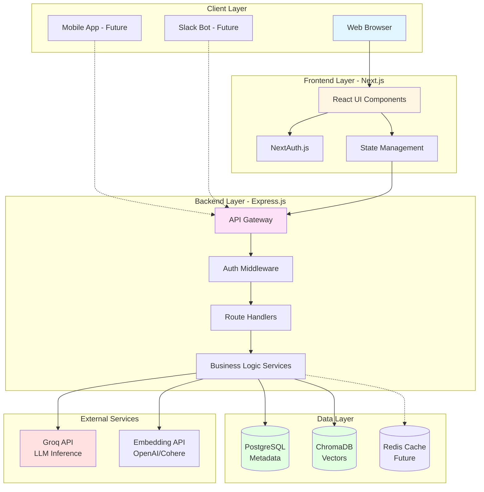
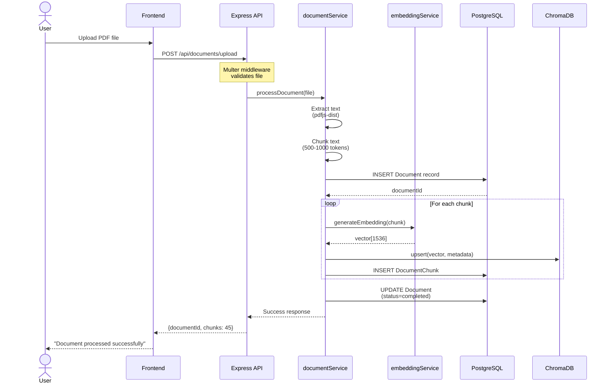
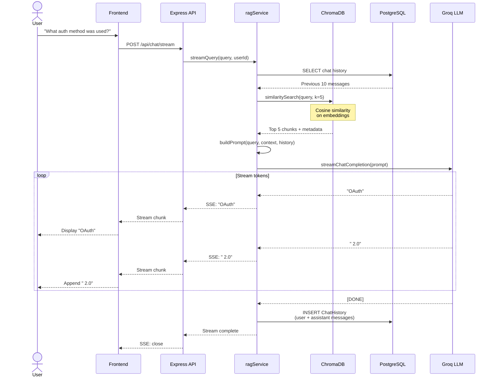
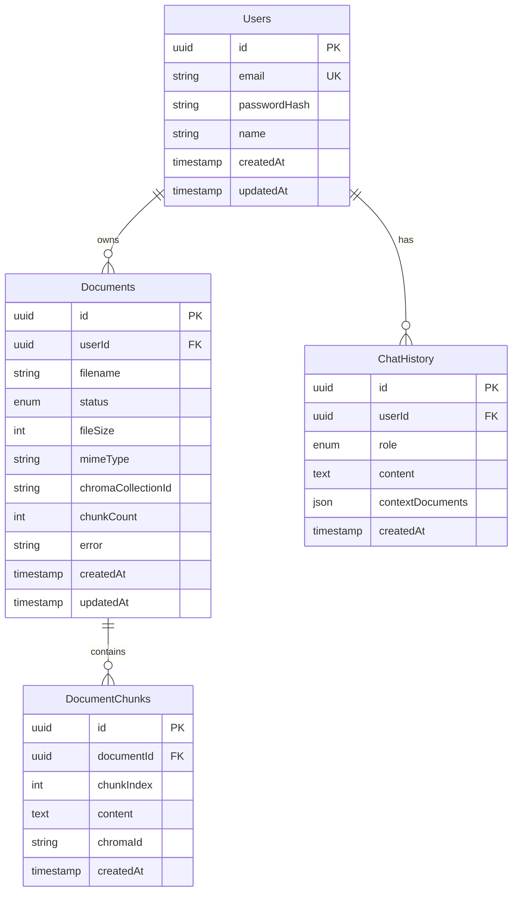
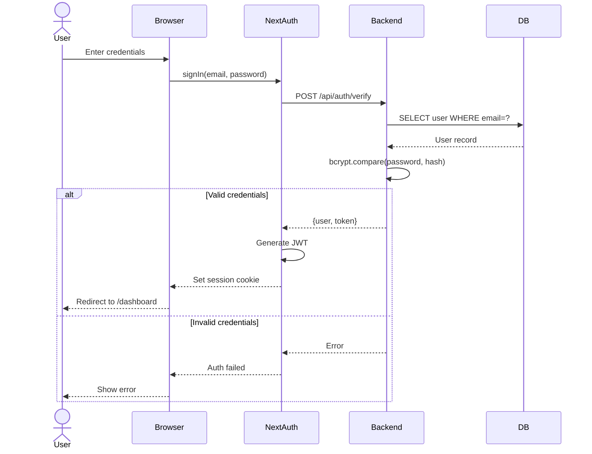
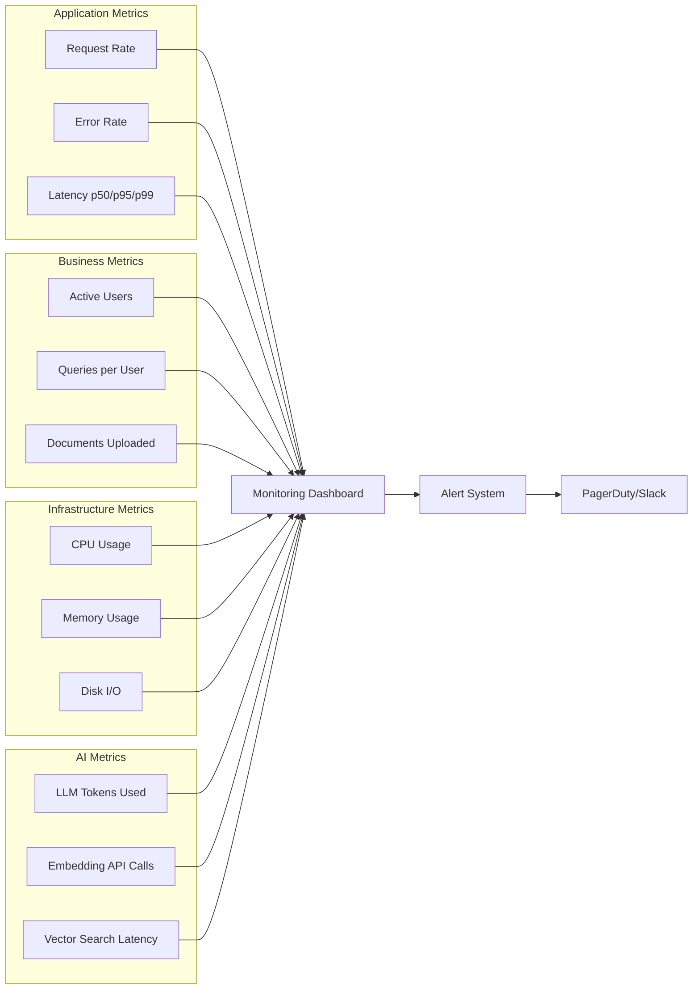

# RAG Enterprise System - Architecture Documentation

**Last Updated:** 2025-11-08
**Version:** 1.0
**Status:** MVP Implementation

---

## Table of Contents

1. [System Overview](#system-overview)
2. [High-Level Architecture](#high-level-architecture)
3. [Component Architecture](#component-architecture)
4. [Data Flow Diagrams](#data-flow-diagrams)
5. [Database Architecture](#database-architecture)
6. [Deployment Architecture](#deployment-architecture)
7. [Security Architecture](#security-architecture)
8. [Technology Stack Matrix](#technology-stack-matrix)

---

## System Overview

The RAG Enterprise system is a three-tier architecture designed to provide intelligent document search and retrieval using semantic search and AI-generated responses. The system handles document ingestion, vector embedding, semantic retrieval, and natural language response generation.

### Core Capabilities

| Capability | Description | Implementation |
|------------|-------------|----------------|
| **Document Ingestion** | Upload and process PDF/TXT/MD files | Multer + pdfjs-dist + LangChain |
| **Text Chunking** | Split documents into semantic chunks | RecursiveCharacterTextSplitter (500-1000 tokens) |
| **Vector Embedding** | Convert text to vector embeddings | Placeholder (→ OpenAI/Cohere) |
| **Semantic Search** | Find relevant chunks via similarity | ChromaDB cosine similarity |
| **Response Generation** | AI-powered answers with citations | Groq LLM (llama-3.1-70b) |
| **Conversation Memory** | Multi-turn conversation context | PostgreSQL chat history |

---

## High-Level Architecture



---

## Component Architecture

### 3-Tier Architecture Breakdown

```
┌─────────────────────────────────────────────────────────────────────┐
│                         TIER 1: PRESENTATION                         │
│                                                                      │
│  ┌────────────┐  ┌─────────────┐  ┌──────────────┐  ┌───────────┐ │
│  │   Login    │  │  Dashboard  │  │   Chat UI    │  │  Documents│ │
│  │   Page     │  │   Overview  │  │  Interface   │  │  Manager  │ │
│  └────────────┘  └─────────────┘  └──────────────┘  └───────────┘ │
│         │                │                │                │         │
│         └────────────────┴────────────────┴────────────────┘         │
│                              │                                       │
│                    ┌─────────▼──────────┐                           │
│                    │   API Client       │                           │
│                    │  (Fetch/Axios)     │                           │
│                    └─────────┬──────────┘                           │
└──────────────────────────────┼───────────────────────────────────────┘
                               │ HTTP/REST
┌──────────────────────────────▼───────────────────────────────────────┐
│                         TIER 2: APPLICATION                          │
│                                                                      │
│  ┌──────────────────────────────────────────────────────────────┐  │
│  │                     API Gateway Layer                         │  │
│  │  • Rate Limiting  • CORS  • Helmet Security  • Logging       │  │
│  └───────────────────────────┬──────────────────────────────────┘  │
│                              │                                      │
│  ┌───────────────────────────▼──────────────────────────────────┐  │
│  │                     Route Layer                               │  │
│  │  ┌──────────────────┐         ┌─────────────────────┐        │  │
│  │  │ Document Routes  │         │    Chat Routes      │        │  │
│  │  │ • POST /upload   │         │ • POST /query       │        │  │
│  │  │ • GET  /list     │         │ • POST /stream      │        │  │
│  │  │ • DELETE /:id    │         │ • GET  /history     │        │  │
│  │  └────────┬─────────┘         └──────────┬──────────┘        │  │
│  └───────────┼────────────────────────────────┼──────────────────┘  │
│              │                                │                     │
│  ┌───────────▼────────────────────────────────▼──────────────────┐  │
│  │                     Service Layer                              │  │
│  │  ┌─────────────────┐  ┌──────────────────┐  ┌──────────────┐ │  │
│  │  │ documentService │  │  embeddingService│  │  ragService  │ │  │
│  │  │                 │  │                  │  │              │ │  │
│  │  │ • processDoc()  │  │ • generateEmbed()│  │ • query()    │ │  │
│  │  │ • chunkText()   │  │ • batchEmbed()   │  │ • stream()   │ │  │
│  │  │ • storeChunks() │  │                  │  │ • buildCtx() │ │  │
│  │  └────────┬────────┘  └─────────┬────────┘  └──────┬───────┘ │  │
│  └───────────┼───────────────────────┼──────────────────┼─────────┘  │
└──────────────┼───────────────────────┼──────────────────┼────────────┘
               │                       │                  │
┌──────────────▼───────────────────────▼──────────────────▼────────────┐
│                         TIER 3: DATA                                 │
│                                                                      │
│  ┌─────────────────────┐  ┌──────────────────┐  ┌────────────────┐ │
│  │   PostgreSQL        │  │    ChromaDB      │  │   Groq API     │ │
│  │                     │  │                  │  │                │ │
│  │ • Users             │  │ • rag_documents  │  │ • llama-3.1    │ │
│  │ • Documents         │  │ • Embeddings     │  │ • 70B params   │ │
│  │ • DocumentChunks    │  │ • Cosine Search  │  │ • Streaming    │ │
│  │ • ChatHistory       │  │                  │  │                │ │
│  └─────────────────────┘  └──────────────────┘  └────────────────┘ │
└──────────────────────────────────────────────────────────────────────┘
```

---

## Data Flow Diagrams

### Flow 1: Document Upload & Processing



### Flow 2: RAG Query Processing



---

## Database Architecture

### PostgreSQL Schema



### Database Responsibilities

| Database | Stores | Why This DB |
|----------|--------|-------------|
| **PostgreSQL** | Users, Documents, DocumentChunks (text), ChatHistory | Transactional data, metadata, relationships, ACID compliance |
| **ChromaDB** | Vector embeddings, chunk metadata | Fast vector similarity search, optimized for semantic retrieval |
| **Redis** (Future) | Session data, query cache, job queue | Sub-millisecond lookups, ephemeral data, pub/sub |

### Data Duplication Strategy

**DocumentChunks table duplicates data:**
- **PostgreSQL**: Stores `chunk.content` (text) + `chromaId` (reference)
- **ChromaDB**: Stores `embedding` (vector) + `content` (metadata)

**Rationale:**
- Enables SQL queries on chunk content (debugging, analytics)
- Allows rebuilding ChromaDB from PostgreSQL if needed
- Provides audit trail and versioning
- Trade-off: 2x storage cost for chunk text (acceptable for text data)

---

## Deployment Architecture

### Current Development Setup

```
┌─────────────────────────────────────────────────────────────────┐
│                    Developer Laptop (macOS)                      │
│                                                                  │
│  ┌────────────────────┐         ┌──────────────────────┐       │
│  │  Frontend Process  │         │   Backend Process     │       │
│  │  Port: 3000        │         │   Port: 3001          │       │
│  │  Next.js dev       │         │   Express + nodemon   │       │
│  └────────────────────┘         └──────────────────────┘       │
│                                                                  │
│  ┌──────────────────────────────────────────────────────────┐  │
│  │              Docker Compose Services                      │  │
│  │  ┌──────────────────┐      ┌──────────────────────┐     │  │
│  │  │   PostgreSQL     │      │     ChromaDB         │     │  │
│  │  │   Port: 5432     │      │     Port: 8000       │     │  │
│  │  │   Volume: pgdata │      │  Volume: chromadata  │     │  │
│  │  └──────────────────┘      └──────────────────────┘     │  │
│  └──────────────────────────────────────────────────────────┘  │
│                                                                  │
│  External API: Groq (https://api.groq.com)                      │
└──────────────────────────────────────────────────────────────────┘
```

### Proposed Production Architecture (Phase 3)

```
┌─────────────────────────────────────────────────────────────────────┐
│                          AWS Cloud / VPC                             │
│                                                                      │
│  ┌─────────────────────────────────────────────────────────────┐   │
│  │                   Public Subnet                              │   │
│  │  ┌──────────────────┐         ┌──────────────────────┐     │   │
│  │  │  Application     │         │   Application         │     │   │
│  │  │  Load Balancer   │────────▶│   Load Balancer       │     │   │
│  │  │  (ALB)           │         │   (ALB)               │     │   │
│  │  └────────┬─────────┘         └──────────┬────────────┘     │   │
│  └───────────┼────────────────────────────────┼─────────────────┘   │
│              │                                │                     │
│  ┌───────────▼────────────────────────────────▼─────────────────┐   │
│  │                   Private Subnet                              │   │
│  │                                                                │   │
│  │  ┌─────────────────────────────────────────────────────────┐ │   │
│  │  │          ECS / EKS Cluster (Auto-scaling)               │ │   │
│  │  │  ┌─────────────┐  ┌─────────────┐  ┌─────────────┐    │ │   │
│  │  │  │  Next.js    │  │  Next.js    │  │  Next.js    │    │ │   │
│  │  │  │  Container  │  │  Container  │  │  Container  │    │ │   │
│  │  │  └─────────────┘  └─────────────┘  └─────────────┘    │ │   │
│  │  │  ┌─────────────┐  ┌─────────────┐                     │ │   │
│  │  │  │  Express    │  │  Express    │                     │ │   │
│  │  │  │  Container  │  │  Container  │                     │ │   │
│  │  │  └─────────────┘  └─────────────┘                     │ │   │
│  │  └─────────────────────────────────────────────────────────┘ │   │
│  │                                                                │   │
│  │  ┌─────────────────────────────────────────────────────────┐ │   │
│  │  │               Database Subnet                            │ │   │
│  │  │  ┌──────────────┐  ┌──────────────┐  ┌──────────────┐  │ │   │
│  │  │  │  RDS Postgres│  │   ElastiCache │  │   Weaviate   │  │ │   │
│  │  │  │  Multi-AZ    │  │     Redis     │  │   Cluster    │  │ │   │
│  │  │  └──────────────┘  └──────────────┘  └──────────────┘  │ │   │
│  │  └─────────────────────────────────────────────────────────┘ │   │
│  └────────────────────────────────────────────────────────────────┘   │
│                                                                      │
│  External: Groq API, OpenAI Embeddings, CloudWatch, S3 (backups)    │
└──────────────────────────────────────────────────────────────────────┘
```

### Deployment Evolution

| Phase | Infrastructure | Rationale |
|-------|---------------|-----------|
| **Phase 1-2 (MVP)** | Local Docker Compose | Fastest development, zero cloud cost |
| **Phase 2.5 (Pilot)** | Single EC2 instance + Docker | Shared access for 20 users, ~$50/mo |
| **Phase 3 (Production)** | ECS/EKS + RDS + Weaviate | Auto-scaling, HA, 99.9% uptime |
| **Phase 4 (Scale)** | Multi-region, CDN, edge caching | Global performance, DR strategy |

---

## Security Architecture

### Authentication Flow



### Security Layers

| Layer | Protection | Implementation Status |
|-------|-----------|----------------------|
| **Transport** | HTTPS/TLS 1.3 | ⏳ Production only |
| **Authentication** | JWT + Session cookies | 🔄 NextAuth configured |
| **Authorization** | User ID verification | ⏳ Middleware pending |
| **Rate Limiting** | 100 req/min per IP | ✅ Express middleware |
| **Input Validation** | File type, size checks | ✅ Multer + custom logic |
| **SQL Injection** | Parameterized queries | ✅ Prisma ORM |
| **XSS Protection** | Content Security Policy | ✅ Helmet.js |
| **CORS** | Whitelist origins | ✅ Configured |
| **API Key Security** | Environment variables | ✅ .env files |

### Access Control Matrix

| Role | Upload Docs | Query Docs | Delete Own Docs | Delete Any Docs | Admin Dashboard |
|------|------------|-----------|----------------|----------------|----------------|
| **User** | ✅ | ✅ (own + public) | ✅ | ❌ | ❌ |
| **Admin** | ✅ | ✅ (all) | ✅ | ✅ | ✅ |
| **System** | ✅ | ✅ | ✅ | ✅ | ✅ |

---

## Technology Stack Matrix

### Complete Stack Overview

| Layer | Technology | Version | Purpose | Status |
|-------|-----------|---------|---------|--------|
| **Frontend Framework** | Next.js | 14.2.5 | React framework with SSR | ✅ Implemented |
| **Frontend Language** | TypeScript | 5.x | Type-safe JavaScript | ✅ Implemented |
| **UI Styling** | Tailwind CSS | 3.x | Utility-first CSS | ✅ Implemented |
| **Authentication** | NextAuth.js | 4.x | Auth for Next.js | 🔄 Configured |
| **Backend Framework** | Express.js | 4.19.2 | Node.js web framework | ✅ Implemented |
| **Backend Language** | JavaScript (Node) | 20.x | Server-side runtime | ✅ Implemented |
| **ORM** | Prisma | 5.7.1 | Type-safe database client | ✅ Implemented |
| **Relational DB** | PostgreSQL | 15 | Metadata storage | ✅ Configured |
| **Vector DB** | ChromaDB | Latest | Embedding storage | ✅ Configured |
| **LLM API** | Groq | - | Fast inference | ✅ Integrated |
| **LLM Model** | llama-3.1-70b-versatile | - | Text generation | ✅ Integrated |
| **PDF Processing** | pdfjs-dist | 4.0.379 | PDF text extraction | ✅ Implemented |
| **Text Chunking** | LangChain | 0.1.x | Document splitting | ✅ Implemented |
| **File Upload** | Multer | 1.4.5 | Multipart form handling | ✅ Implemented |
| **API Documentation** | Swagger UI | 5.x | OpenAPI visualization | ✅ Implemented |
| **Security** | Helmet.js | 7.x | HTTP security headers | ✅ Implemented |
| **CORS** | cors | 2.8.5 | Cross-origin resource sharing | ✅ Implemented |
| **Rate Limiting** | express-rate-limit | 7.x | Request throttling | ✅ Implemented |
| **Containerization** | Docker | 24.x | Service isolation | ✅ Configured |
| **Orchestration** | Docker Compose | 2.x | Multi-container apps | ✅ Configured |

### Key Dependencies Count

- **Frontend**: 443 npm packages
- **Backend**: 233 npm packages
- **Total Project Size**: ~676 packages

---

## API Architecture

### RESTful Endpoint Structure

```
/api
├── /documents
│   ├── POST   /upload          → Upload & process document
│   ├── GET    /                → List user's documents
│   ├── GET    /:id             → Get document details + chunks
│   └── DELETE /:id             → Delete document from both DBs
│
├── /chat
│   ├── POST   /query           → RAG query (JSON response)
│   ├── POST   /stream          → RAG query (SSE streaming)
│   ├── GET    /history         → Get conversation history
│   └── DELETE /history         → Clear conversation history
│
├── /auth (Future - NextAuth handles this)
│   ├── POST   /login
│   ├── POST   /logout
│   └── GET    /session
│
└── /admin (Future)
    ├── GET    /analytics
    ├── GET    /users
    └── POST   /reindex
```

### Request/Response Flow

**Example: Document Upload**

```javascript
// Request
POST /api/documents/upload
Content-Type: multipart/form-data

file: mobile-auth-spec.pdf (2.3 MB)
userId: 550e8400-e29b-41d4-a716-446655440000

// Response
{
  "documentId": "123e4567-e89b-12d3-a456-426614174000",
  "filename": "mobile-auth-spec.pdf",
  "status": "completed",
  "chunks": 47,
  "processingTime": "3.2s"
}
```

**Example: Streaming Query**

```javascript
// Request
POST /api/chat/stream
Content-Type: application/json

{
  "query": "What authentication method was used?",
  "userId": "550e8400-e29b-41d4-a716-446655440000"
}

// Response (Server-Sent Events)
data: {"type":"token","content":"OAuth"}

data: {"type":"token","content":" 2.0"}

data: {"type":"token","content":" with"}

data: {"type":"sources","documents":["mobile-auth-spec.pdf"]}

data: {"type":"done"}
```

---

## Performance Considerations

### Latency Budgets

| Operation | Target | Current | Bottleneck |
|-----------|--------|---------|------------|
| Document upload (1MB PDF) | <5s | ~3-4s | PDF parsing + chunking |
| Embedding generation (1 chunk) | <100ms | TBD | Placeholder function |
| Vector search (top 5) | <200ms | ~150ms | ChromaDB query |
| LLM first token | <1s | ~800ms | Groq API latency |
| LLM streaming (50 tokens) | <3s | ~2-2.5s | Groq inference |
| **Total RAG query** | <5s | ~4s | Acceptable for MVP |

### Scalability Limits (Current Architecture)

| Component | Limit | Mitigation Strategy |
|-----------|-------|---------------------|
| **ChromaDB** | ~1M vectors | Migrate to Weaviate (10M+) |
| **PostgreSQL** | ~10K concurrent connections | Connection pooling (Prisma) |
| **Express** | ~1K req/s per instance | Horizontal scaling (load balancer) |
| **Groq API** | Rate limits vary | Queue requests, cache responses |
| **Single EC2 instance** | 4 vCPU bottleneck | Move to ECS/EKS cluster |

---

## Monitoring & Observability

### Metrics to Track (Future Implementation)



---

## Summary

This architecture provides:

✅ **Separation of Concerns** - Frontend, backend, and data layers are independent
✅ **Scalability Path** - Can grow from MVP to enterprise-scale
✅ **Technology Flexibility** - Can swap ChromaDB, LLMs, or embedding providers
✅ **Security by Design** - Multiple layers of protection
✅ **Cost Efficiency** - Start small, scale based on usage

**Current Status**: MVP architecture implemented, ready for pilot testing with planned migration path to production-grade infrastructure.

---

**Document Version:** 1.0
**Next Review:** After Phase 2 completion
**Maintained By:** Engineering Team
