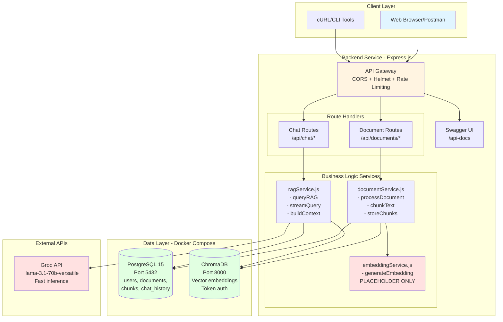
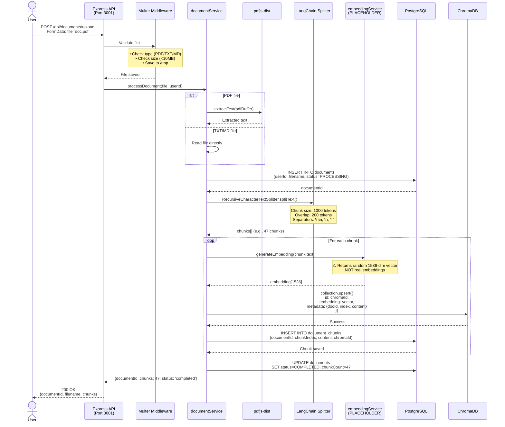
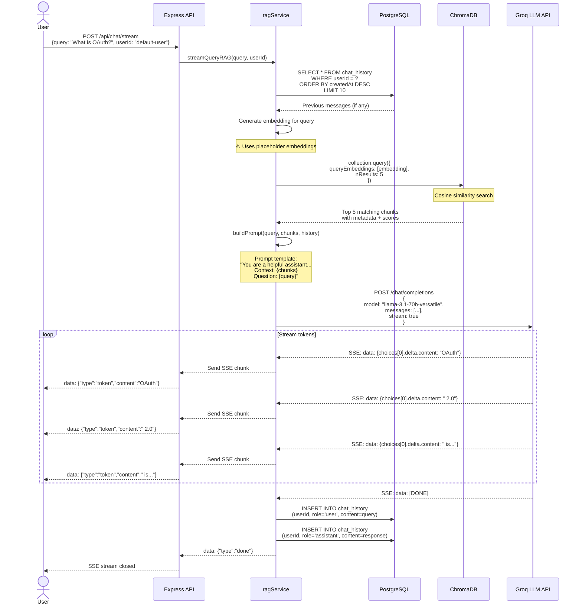
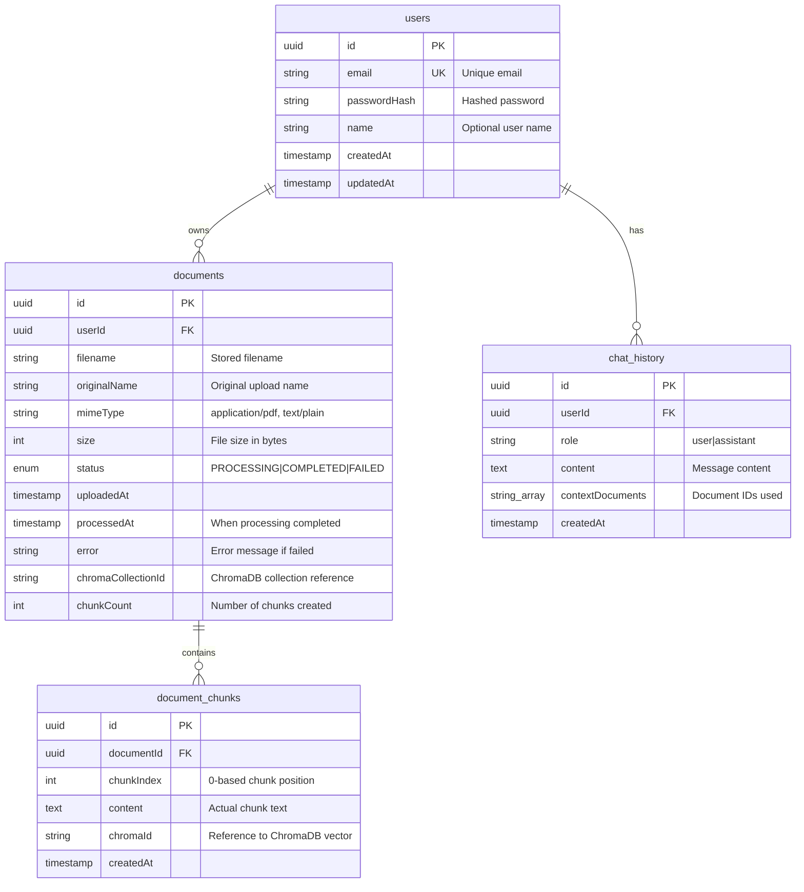
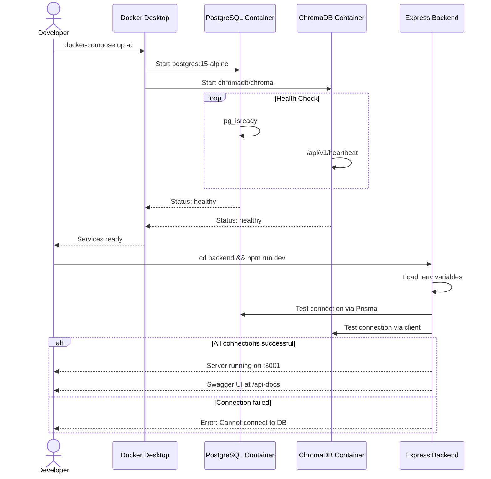
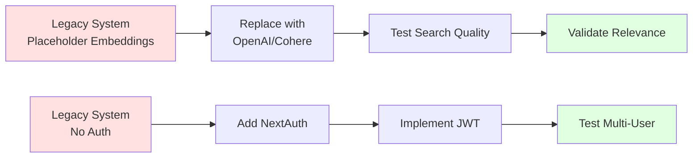
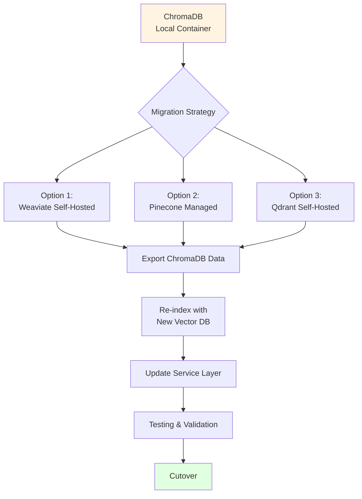

# RAG Legacy System - Architecture Documentation

**Last Updated:** 2025-11-08
**Version:** Legacy v1.0
**Status:** Backup/Reference Implementation

---

## Table of Contents

1. [System Overview](#system-overview)
2. [High-Level Architecture](#high-level-architecture)
3. [Component Architecture](#component-architecture)
4. [Data Flow Diagrams](#data-flow-diagrams)
5. [Database Architecture](#database-architecture)
6. [Deployment Architecture](#deployment-architecture)
7. [Technology Stack Comparison](#technology-stack-comparison)
8. [Migration Path](#migration-path)

---

## System Overview

The legacy RAG system is a 3-layer architecture implementation that served as the initial prototype for the enterprise RAG platform. It demonstrates the core RAG pipeline functionality with simplified authentication and single-tenant design.

### Core Capabilities

| Capability | Implementation | Status |
|------------|----------------|--------|
| **Document Upload** | Express + Multer (PDF/TXT/MD) | ✅ Functional |
| **Text Extraction** | pdfjs-dist for PDFs | ✅ Functional |
| **Text Chunking** | LangChain RecursiveCharacterTextSplitter | ✅ Functional |
| **Vector Embedding** | Placeholder (hardcoded vectors) | ⚠️ Non-production |
| **Vector Storage** | ChromaDB with token auth | ✅ Functional |
| **Semantic Search** | Cosine similarity search | ✅ Functional |
| **LLM Generation** | Groq API (llama-3.1-70b-versatile) | ✅ Functional |
| **Response Streaming** | Server-Sent Events (SSE) | ✅ Functional |
| **Chat History** | PostgreSQL storage | ✅ Functional |
| **API Documentation** | Swagger UI + OpenAPI 3.0 | ✅ Complete |

### Key Characteristics

- **Single-Tenant**: Uses `default-user` for all operations
- **No Authentication**: Placeholder user ID, no JWT/session validation
- **Monolithic Services**: All services in single backend process
- **Local Development Only**: Designed for Docker Compose setup
- **Prototype Embeddings**: Returns fixed-dimension random vectors

---

## High-Level Architecture



---

## Component Architecture

### Layered Architecture Breakdown

```
┌───────────────────────────────────────────────────────────────────────┐
│                      PRESENTATION LAYER                                │
│              (No frontend - API endpoints only)                        │
│                                                                        │
│  Clients: Postman, cURL, Browser (Swagger UI), Future Frontend       │
└────────────────────────────┬──────────────────────────────────────────┘
                             │ HTTP REST
┌────────────────────────────▼──────────────────────────────────────────┐
│                    APPLICATION LAYER                                   │
│                      Express.js Backend                                │
│                                                                        │
│  ┌──────────────────────────────────────────────────────────────────┐ │
│  │                   Middleware Stack                                │ │
│  │  ┌──────────┐ ┌────────┐ ┌────────────┐ ┌──────────────────┐   │ │
│  │  │  Helmet  │ │  CORS  │ │Rate Limiter│ │  Morgan Logger   │   │ │
│  │  │ Security │ │ Origin │ │100 req/15m │ │  Dev logging     │   │ │
│  │  └──────────┘ └────────┘ └────────────┘ └──────────────────┘   │ │
│  └──────────────────────────────────────────────────────────────────┘ │
│                                                                        │
│  ┌──────────────────────────────────────────────────────────────────┐ │
│  │                     Route Layer                                   │ │
│  │                                                                   │ │
│  │  ┌────────────────────────────────────────────────────────────┐ │ │
│  │  │  Document Management Routes                                 │ │ │
│  │  │  POST   /api/documents/upload                               │ │ │
│  │  │  GET    /api/documents?userId=default-user                  │ │ │
│  │  │  GET    /api/documents/:id                                  │ │ │
│  │  │  DELETE /api/documents/:id                                  │ │ │
│  │  └────────────────────────────────────────────────────────────┘ │ │
│  │                                                                   │ │
│  │  ┌────────────────────────────────────────────────────────────┐ │ │
│  │  │  Chat/RAG Routes                                            │ │ │
│  │  │  POST   /api/chat/query         (JSON response)            │ │ │
│  │  │  POST   /api/chat/stream        (SSE streaming)            │ │ │
│  │  │  GET    /api/chat/history?userId=default-user              │ │ │
│  │  │  DELETE /api/chat/history?userId=default-user              │ │ │
│  │  └────────────────────────────────────────────────────────────┘ │ │
│  └──────────────────────────────────────────────────────────────────┘ │
│                                                                        │
│  ┌──────────────────────────────────────────────────────────────────┐ │
│  │                    Service Layer                                  │ │
│  │                                                                   │ │
│  │  ┌──────────────────────────────────────────────────────────┐  │ │
│  │  │  documentService.js                                       │  │ │
│  │  │  • uploadDocument(file, userId)                           │  │ │
│  │  │    → Extract text from PDF/TXT/MD                         │  │ │
│  │  │    → Chunk text (500-1000 tokens)                         │  │ │
│  │  │    → Generate embeddings per chunk                        │  │ │
│  │  │    → Store in ChromaDB + PostgreSQL                       │  │ │
│  │  │  • listDocuments(userId)                                  │  │ │
│  │  │  • getDocument(documentId)                                │  │ │
│  │  │  • deleteDocument(documentId)                             │  │ │
│  │  │    → Cascade delete from ChromaDB + PostgreSQL            │  │ │
│  │  └──────────────────────────────────────────────────────────┘  │ │
│  │                                                                   │ │
│  │  ┌──────────────────────────────────────────────────────────┐  │ │
│  │  │  embeddingService.js                                      │  │ │
│  │  │  ⚠️  PLACEHOLDER IMPLEMENTATION                           │  │ │
│  │  │  • generateEmbedding(text)                                │  │ │
│  │  │    → Returns random 1536-dim vector                       │  │ │
│  │  │  • batchGenerateEmbeddings(texts)                         │  │ │
│  │  │    → Returns array of random vectors                      │  │ │
│  │  │                                                            │  │ │
│  │  │  🔴 NOT PRODUCTION READY                                  │  │ │
│  │  │  Replace with: OpenAI, Cohere, or sentence-transformers  │  │ │
│  │  └──────────────────────────────────────────────────────────┘  │ │
│  │                                                                   │ │
│  │  ┌──────────────────────────────────────────────────────────┐  │ │
│  │  │  ragService.js                                            │  │ │
│  │  │  • queryRAG(query, userId)                                │  │ │
│  │  │    1. Retrieve chat history (last 10 messages)            │  │ │
│  │  │    2. Semantic search ChromaDB (top 5 chunks)             │  │ │
│  │  │    3. Build prompt with context + history                 │  │ │
│  │  │    4. Call Groq LLM for generation                        │  │ │
│  │  │    5. Save to chat history                                │  │ │
│  │  │  • streamQueryRAG(query, userId)                          │  │ │
│  │  │    → Same as above but streams via SSE                    │  │ │
│  │  └──────────────────────────────────────────────────────────┘  │ │
│  └──────────────────────────────────────────────────────────────────┘ │
└────────────────────────────────────────────────────────────────────────┘
                               │         │           │
┌──────────────────────────────▼─────────▼───────────▼──────────────────┐
│                           DATA LAYER                                   │
│                                                                        │
│  ┌────────────────────────┐  ┌─────────────────────┐  ┌────────────┐ │
│  │   PostgreSQL 15        │  │   ChromaDB          │  │  Groq API  │ │
│  │   (Docker Container)   │  │   (Docker Container)│  │  (External)│ │
│  │                        │  │                     │  │            │ │
│  │ Tables:                │  │ Collection:         │  │ Model:     │ │
│  │ • users                │  │ • rag_documents     │  │ llama-3.1  │ │
│  │ • documents            │  │                     │  │ 70B params │ │
│  │ • document_chunks      │  │ Metadata:           │  │            │ │
│  │ • chat_history         │  │ • chromaId          │  │ Features:  │ │
│  │                        │  │ • documentId        │  │ • Streaming│ │
│  │ Port: 5432             │  │ • chunkIndex        │  │ • Fast     │ │
│  │ Volume: postgres_data  │  │ • content           │  │ • <$1/M    │ │
│  │                        │  │                     │  │   tokens   │ │
│  │ Auth:                  │  │ Search:             │  │            │ │
│  │ User: raguser          │  │ • Cosine similarity │  │            │ │
│  │ Pass: ragpassword      │  │ • Top-K retrieval   │  │            │ │
│  │ DB: ragdb              │  │                     │  │            │ │
│  │                        │  │ Auth:               │  │            │ │
│  │ ORM: Prisma 5.7.1      │  │ Token: test-token   │  │            │ │
│  └────────────────────────┘  └─────────────────────┘  └────────────┘ │
└────────────────────────────────────────────────────────────────────────┘
```

---

## Data Flow Diagrams

### Flow 1: Document Upload & Chunking



### Flow 2: RAG Query with Streaming



---

## Database Architecture

### PostgreSQL Schema (Prisma ORM)



### Database Schema Details

| Table | Rows (Typical) | Size | Purpose |
|-------|---------------|------|---------|
| **users** | 1-1000 | <100KB | User authentication (currently single user: `default-user`) |
| **documents** | 10-10,000 | <1MB | Track uploaded files and processing status |
| **document_chunks** | 100-500K | 50-500MB | Store chunk text + ChromaDB references |
| **chat_history** | 1K-1M | 10-100MB | Conversation history for context |

### Data Storage Strategy

**Dual Storage for Chunks:**
```
┌────────────────────────────────────────────────────────────────┐
│                     Document Chunk Data                         │
├────────────────────────────────────────────────────────────────┤
│                                                                 │
│  PostgreSQL (document_chunks table)                            │
│  ├─ Stores: chunk.content (full text)                          │
│  ├─ Stores: chromaId (reference to vector)                     │
│  ├─ Enables: SQL queries, text search, reconstruction          │
│  └─ Size: ~500KB per 1000 chunks                              │
│                                                                 │
│  ChromaDB (rag_documents collection)                           │
│  ├─ Stores: embedding vector (1536 dimensions)                 │
│  ├─ Stores: metadata {documentId, chunkIndex, content}         │
│  ├─ Enables: Semantic similarity search                        │
│  └─ Size: ~6MB per 1000 chunks (vectors only)                 │
│                                                                 │
│  ⚠️  content is duplicated in both databases                   │
│  ✅  Trade-off: Redundancy for reliability and flexibility     │
└────────────────────────────────────────────────────────────────┘
```

**Why Duplicate Data?**
- **PostgreSQL**: Source of truth, enables rebuilding ChromaDB if needed
- **ChromaDB**: Optimized for vector search, not reliable for text storage
- **Recovery**: Can regenerate embeddings from PostgreSQL chunks
- **Debugging**: Can inspect actual chunk content via SQL

---

## Deployment Architecture

### Current Development Setup

```
┌─────────────────────────────────────────────────────────────────┐
│              Developer MacBook (macOS Darwin 24.6.0)             │
│                                                                  │
│  ┌────────────────────────────────────────────────────────────┐ │
│  │              Docker Desktop (Required)                      │ │
│  │                                                              │ │
│  │  ┌─────────────────────┐    ┌─────────────────────┐       │ │
│  │  │  PostgreSQL 15      │    │  ChromaDB Latest     │       │ │
│  │  │  Container          │    │  Container           │       │ │
│  │  │                     │    │                      │       │ │
│  │  │  Name: rag-postgres │    │  Name: rag-chromadb  │       │ │
│  │  │  Port: 5432         │    │  Port: 8000          │       │ │
│  │  │  Image: postgres:   │    │  Image: chromadb/    │       │ │
│  │  │         15-alpine   │    │         chroma:latest│       │ │
│  │  │                     │    │                      │       │ │
│  │  │  Volume:            │    │  Volume:             │       │ │
│  │  │  postgres_data      │    │  chroma_data         │       │ │
│  │  │  (Persistent)       │    │  (Persistent)        │       │ │
│  │  │                     │    │                      │       │ │
│  │  │  Health Check:      │    │  Health Check:       │       │ │
│  │  │  pg_isready         │    │  /api/v1/heartbeat   │       │ │
│  │  │  every 10s          │    │  every 10s           │       │ │
│  │  └─────────────────────┘    └─────────────────────┘       │ │
│  └────────────────────────────────────────────────────────────┘ │
│                                                                  │
│  ┌────────────────────────────────────────────────────────────┐ │
│  │        Backend Process (Node.js)                            │ │
│  │                                                              │ │
│  │  Directory: /Users/bv/Code/experimental_rag/legacy/backend  │ │
│  │  Command: npm run dev (nodemon index.js)                    │ │
│  │  Port: 3001                                                  │ │
│  │  Dependencies: 233 npm packages                             │ │
│  │                                                              │ │
│  │  Environment Variables (.env):                              │ │
│  │  • DATABASE_URL=postgresql://raguser:ragpassword@          │ │
│  │                  localhost:5432/ragdb                        │ │
│  │  • CHROMA_URL=http://localhost:8000                         │ │
│  │  • CHROMA_TOKEN=test-token                                  │ │
│  │  • GROQ_API_KEY=<user-provided>                             │ │
│  │  • PORT=3001                                                 │ │
│  │  • NODE_ENV=development                                      │ │
│  └────────────────────────────────────────────────────────────┘ │
│                                                                  │
│  ┌────────────────────────────────────────────────────────────┐ │
│  │        Frontend (Next.js - Minimal)                         │ │
│  │                                                              │ │
│  │  Directory: /Users/bv/Code/experimental_rag/legacy/         │ │
│  │             rag-frontend                                     │ │
│  │  Status: Only .next build artifacts, no source files        │ │
│  │  Note: Frontend not actively used in legacy setup           │ │
│  └────────────────────────────────────────────────────────────┘ │
│                                                                  │
│  External APIs:                                                  │
│  • Groq API: https://api.groq.com/openai/v1                    │
│  • Embedding API: None (placeholder implementation)             │
└──────────────────────────────────────────────────────────────────┘
```

### Docker Compose Configuration

```yaml
# docker-compose.yml
services:
  postgres:
    image: postgres:15-alpine
    container_name: rag-postgres
    ports: ["5432:5432"]
    environment:
      POSTGRES_USER: raguser
      POSTGRES_PASSWORD: ragpassword
      POSTGRES_DB: ragdb
    volumes: [postgres_data:/var/lib/postgresql/data]
    healthcheck:
      test: ["CMD-SHELL", "pg_isready -U raguser -d ragdb"]
      interval: 10s
      timeout: 5s
      retries: 5

  chromadb:
    image: chromadb/chroma:latest
    container_name: rag-chromadb
    ports: ["8000:8000"]
    environment:
      CHROMA_SERVER_AUTH_CREDENTIALS_PROVIDER: chromadb.auth.token.TokenAuthCredentialsProvider
      CHROMA_SERVER_AUTH_CREDENTIALS: test-token
      CHROMA_SERVER_AUTH_PROVIDER: chromadb.auth.token.TokenAuthenticationServerProvider
      ALLOW_RESET: TRUE
    volumes: [chroma_data:/chroma/chroma]
    healthcheck:
      test: ["CMD", "curl", "-f", "http://localhost:8000/api/v1/heartbeat"]
      interval: 10s
```

### Startup Sequence



---

## Technology Stack Comparison

### Legacy vs. Current Implementation

| Component | Legacy System | Current/Planned System | Difference |
|-----------|---------------|------------------------|------------|
| **Backend Framework** | Express.js | Express.js | Same |
| **Frontend** | None (API-only) | Next.js 14 + TypeScript | Frontend added |
| **Authentication** | Hardcoded `default-user` | NextAuth.js + JWT | Proper auth added |
| **ORM** | Prisma 5.7.1 | Prisma 5.7.1 | Same |
| **Relational DB** | PostgreSQL 15 | PostgreSQL 15 | Same |
| **Vector DB** | ChromaDB (local) | ChromaDB → Weaviate (planned) | Migration planned |
| **LLM Provider** | Groq (llama-3.1-70b) | Groq | Same |
| **Embeddings** | Placeholder (random) | OpenAI/Cohere (planned) | Production embeddings needed |
| **PDF Processing** | pdfjs-dist 4.0.0 | pdfjs-dist 4.0.0 | Same |
| **Text Chunking** | LangChain 0.1.0 | LangChain 0.1.0 | Same |
| **API Docs** | Swagger UI + OpenAPI 3.0 | Same | Same |
| **Deployment** | Docker Compose (local) | AWS ECS/EKS (planned) | Cloud deployment planned |
| **Monitoring** | None | Datadog/Grafana (planned) | Monitoring added |
| **CI/CD** | None | GitHub Actions (planned) | Automation added |

### Legacy System Limitations

| Limitation | Impact | Migration Needed |
|------------|--------|------------------|
| **Placeholder Embeddings** | Search returns random results | 🔴 Critical - Replace immediately |
| **No Authentication** | Security risk, no multi-tenancy | 🟡 Medium - Add NextAuth |
| **Single Tenant** | Cannot scale to multiple users | 🟡 Medium - Add user management |
| **ChromaDB Scaling** | Degrades >1M vectors | 🟡 Medium - Migrate to Weaviate |
| **No Frontend** | Requires API clients only | 🟢 Low - Frontend exists separately |
| **No Monitoring** | Cannot detect issues | 🟢 Low - Add in production |
| **Docker Compose Only** | Not production-ready | 🟡 Medium - Deploy to cloud |

---

## API Architecture

### Complete Endpoint Reference

```
Legacy Backend API
http://localhost:3001

┌─────────────────────────────────────────────────────────────────┐
│                     Core Endpoints                               │
├─────────────────────────────────────────────────────────────────┤
│ GET  /health                    → Health check                  │
│ GET  /api-docs                  → Swagger UI documentation      │
└─────────────────────────────────────────────────────────────────┘

┌─────────────────────────────────────────────────────────────────┐
│                 Document Management                              │
├─────────────────────────────────────────────────────────────────┤
│ POST   /api/documents/upload                                    │
│        Headers: Content-Type: multipart/form-data               │
│        Body: {file: File, userId: "default-user"}               │
│        Returns: {documentId, filename, status, chunks}          │
│                                                                  │
│ GET    /api/documents?userId=default-user                       │
│        Returns: [{id, filename, status, chunkCount, ...}]       │
│                                                                  │
│ GET    /api/documents/:id                                       │
│        Returns: {document, chunks: [...]}                       │
│                                                                  │
│ DELETE /api/documents/:id                                       │
│        Cascades: Deletes from PostgreSQL + ChromaDB             │
│        Returns: {message: "Document deleted"}                   │
└─────────────────────────────────────────────────────────────────┘

┌─────────────────────────────────────────────────────────────────┐
│                   Chat / RAG Queries                             │
├─────────────────────────────────────────────────────────────────┤
│ POST   /api/chat/query                                          │
│        Headers: Content-Type: application/json                  │
│        Body: {query: "What is OAuth?", userId: "default-user"}  │
│        Returns: {response: "OAuth 2.0 is...", sources: [...]}   │
│                                                                  │
│ POST   /api/chat/stream                                         │
│        Headers: Content-Type: application/json                  │
│        Body: {query: "Explain...", userId: "default-user"}      │
│        Returns: Server-Sent Events stream                       │
│        Format: data: {"type":"token","content":"..."}           │
│                                                                  │
│ GET    /api/chat/history?userId=default-user                    │
│        Returns: [{role, content, createdAt}, ...]               │
│                                                                  │
│ DELETE /api/chat/history?userId=default-user                    │
│        Returns: {message: "Chat history cleared"}               │
└─────────────────────────────────────────────────────────────────┘
```

### Request/Response Examples

**Example 1: Upload Document**
```bash
curl -X POST http://localhost:3001/api/documents/upload \
  -F "file=@mobile-auth-spec.pdf" \
  -F "userId=default-user"

# Response
{
  "documentId": "550e8400-e29b-41d4-a716-446655440000",
  "filename": "mobile-auth-spec.pdf",
  "status": "completed",
  "chunks": 47,
  "processingTime": "3.2s"
}
```

**Example 2: RAG Query (JSON)**
```bash
curl -X POST http://localhost:3001/api/chat/query \
  -H "Content-Type: application/json" \
  -d '{
    "query": "What authentication method was used?",
    "userId": "default-user"
  }'

# Response
{
  "response": "Based on the uploaded documentation, the mobile app uses OAuth 2.0 with JWT tokens for authentication. The implementation includes biometric authentication as a secondary factor.",
  "sources": [
    {
      "documentId": "550e8400...",
      "filename": "mobile-auth-spec.pdf",
      "relevance": 0.89
    }
  ],
  "processingTime": "4.1s"
}
```

**Example 3: Streaming Query (SSE)**
```bash
curl -X POST http://localhost:3001/api/chat/stream \
  -H "Content-Type: application/json" \
  -d '{"query": "Explain OAuth 2.0", "userId": "default-user"}'

# Response (Server-Sent Events)
data: {"type":"token","content":"OAuth"}

data: {"type":"token","content":" 2.0"}

data: {"type":"token","content":" is"}

data: {"type":"token","content":" an"}

data: {"type":"token","content":" authorization"}

...

data: {"type":"sources","documents":["mobile-auth-spec.pdf"]}

data: {"type":"done"}
```

---

## Performance Characteristics

### Benchmarks (Local Development)

| Operation | Latency (Avg) | Notes |
|-----------|--------------|-------|
| **Document Upload (1MB PDF)** | 3-4s | Including text extraction + chunking |
| **Embedding Generation (1 chunk)** | <1ms | ⚠️ Placeholder only (instant random) |
| **PostgreSQL INSERT (1 chunk)** | 5-10ms | Via Prisma ORM |
| **ChromaDB Upsert (1 vector)** | 10-20ms | Local container |
| **Full Document Processing (50 chunks)** | 4-6s | End-to-end |
| **Vector Search (top 5)** | 150-200ms | ChromaDB query |
| **LLM First Token (Groq)** | 800ms-1.2s | Network latency dependent |
| **LLM Full Response (100 tokens)** | 2-3s | Streaming mode |
| **Total RAG Query** | 4-5s | Search + generation |

### Bottlenecks

```
RAG Query Pipeline Breakdown (5 seconds total)

├─ 0.0s - 0.5s: Chat History Retrieval (PostgreSQL)
├─ 0.5s - 0.7s: Vector Search (ChromaDB) ⚠️ PLACEHOLDER EMBEDDINGS
├─ 0.7s - 1.6s: Groq LLM First Token (Network + Inference)
└─ 1.6s - 5.0s: Groq LLM Streaming (Token generation)

Optimization Opportunities:
1. 🔴 Embedding generation (currently instant, will add 500ms in prod)
2. 🟡 ChromaDB query (can optimize with caching)
3. 🟢 Chat history (negligible impact)
```

---

## Migration Path

### Phase 1: Fix Critical Issues (Week 1-2)



**Tasks:**
- [ ] Integrate OpenAI text-embedding-3-small or Cohere
- [ ] Update `embeddingService.js` to call real API
- [ ] Re-index all existing documents with real embeddings
- [ ] Add NextAuth.js for authentication
- [ ] Replace hardcoded `default-user` with session userId
- [ ] Add JWT middleware to protect routes

### Phase 2: Scale Vector Database (Week 3-4)



**Tasks:**
- [ ] Choose production vector DB (recommendation: Weaviate)
- [ ] Set up Weaviate cluster (Kubernetes or Docker Swarm)
- [ ] Create migration script to export from ChromaDB
- [ ] Re-index all documents in Weaviate
- [ ] Update `config/chromadb.js` → `config/weaviate.js`
- [ ] Add hybrid search (dense + sparse retrieval)
- [ ] Performance testing with 1M+ vectors

### Phase 3: Production Deployment (Week 5-8)

**Tasks:**
- [ ] Deploy to AWS ECS or EKS
- [ ] Set up RDS PostgreSQL (Multi-AZ)
- [ ] Configure ElastiCache Redis for caching
- [ ] Add monitoring (Datadog/Grafana)
- [ ] Implement CI/CD pipeline (GitHub Actions)
- [ ] Add error tracking (Sentry)
- [ ] Load testing and optimization
- [ ] Security audit and penetration testing

---

## Summary

The legacy RAG system provides a functional prototype demonstrating core RAG capabilities:

### ✅ Strengths
- Complete API implementation with 8 endpoints
- Functional document processing pipeline
- Streaming responses via SSE
- Database schema well-designed
- Good separation of concerns
- Comprehensive API documentation

### 🔴 Critical Issues
- **Placeholder embeddings** - Search returns random results
- **No authentication** - Security vulnerability
- **Single-tenant design** - Cannot scale to multiple users

### 🟡 Production Gaps
- ChromaDB not suitable for scale (>1M vectors)
- No monitoring or observability
- Docker Compose not production-ready
- No CI/CD pipeline
- Missing error tracking

### 📋 Recommended Actions

**Immediate (Week 1):**
1. Integrate production embedding API (OpenAI/Cohere)
2. Test search quality with real embeddings
3. Document security risks from lack of auth

**Short-Term (Week 2-4):**
1. Add NextAuth.js authentication
2. Plan vector DB migration (ChromaDB → Weaviate)
3. Implement monitoring and logging

**Long-Term (Month 2-3):**
1. Deploy to AWS cloud infrastructure
2. Add CI/CD automation
3. Scale testing with production workloads

---

**Document Version:** Legacy v1.0
**Last Updated:** 2025-11-08
**Status:** Reference implementation - not production ready
**Maintained By:** Engineering Team
